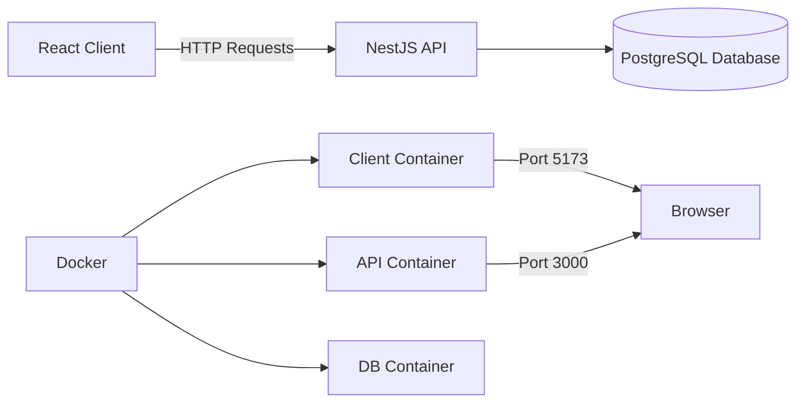

# NineHertz Full-Stack Starter with NestJS & React


## Overview

The NineHertz Full-Stack Starter is a modern application template featuring a NestJS backend with TypeORM and a React frontend with TanStack Query. Designed for rapid development and deployment, this project provides a complete foundation for building enterprise-grade applications with best practices in mind.

**Live Demo**: [https://nine-hertz-demo.com](https://nine-hertz-demo.com) (example)

## Architecture Diagram



## Key Features

### Backend (NestJS)
- 🐳 **Dockerized** container deployment
- 🗄️ **TypeORM** with PostgreSQL integration
- 🛡️ **JWT Authentication** with protected routes
- 📊 **Swagger Documentation** for API endpoints
- 📝 **DTO Validation** with class-validator
- 🔌 **Environment Configuration** system

### Frontend (React)
- ⚡ **Vite** for blazing fast development
- 🔄 **TanStack Query** for data fetching
- 🎨 **Tailwind CSS** for utility-first styling
- 🔐 **Authentication Flow** with protected routes
- 📱 **Fully Responsive** mobile-first design
- 🧩 **Modular Component Architecture**

## Prerequisites

- Node.js v18+
- Docker & Docker Compose
- PNPM (recommended)
- PostgreSQL (for development without Docker)

## Getting Started

### 1. Clone the repository:
```bash
git clone https://github.com/devalentineomonya/NineHertz-NestJs-Tanstack-Start.git
cd NineHertz-NestJs-Tanstack-Start
```

### 2. Configure environment variables:
```bash
# Backend
cp server/.env.example server/.env

# Frontend
cp client/.env.example client/.env.local
```

Edit the files with your configuration values.

### 3. Start with Docker Compose:
```bash
docker-compose up -d --build
```

### 4. Run database migrations:
```bash
docker exec ninehertz-server pnpm typeorm migration:run
```

### 5. Access the applications:
- **API Server**: http://localhost:3000
- **React Client**: http://localhost:5173
- **API Documentation**: http://localhost:3000/api

## Development Workflow

### Start all services:
```bash
docker-compose up -d
```

### Access containers:
```bash
# API container
docker exec -it ninehertz-server sh

# DB container
docker exec -it ninehertz-db psql -U postgres
```

### Generate new migration:
```bash
docker exec ninehertz-server pnpm typeorm migration:generate src/migrations/<MigrationName>
```

### View logs:
```bash
docker-compose logs -f
```

## Project Structure

```
NineHertz-NestJs-Tanstack-Start/
├── client/               # React frontend application
│   ├── public/           # Static assets
│   ├── src/              # Application source code
│   ├── .env.example      # Environment template
│   ├── index.html        # Main HTML template
│   └── vite.config.ts    # Vite configuration
│
├── server/               # NestJS backend application
│   ├── src/              # Application source code
│   ├── docker/           # Docker configuration
│   ├── .env.example      # Environment template
│   └── docker-compose.yml # Docker compose config
│
├── docker-compose.yml    # Main Docker compose file
└── README.md             # Project documentation
```

## Configuration

### Backend (.env)
```env
PORT=3000
DB_HOST=ninehertz-db
DB_PORT=5432
DB_USERNAME=postgres
DB_PASSWORD=postgres
DB_NAME=ninehertz
JWT_SECRET=your-secret-key
JWT_EXPIRES_IN=1h
```

### Frontend (.env.local)
```env
VITE_API_BASE_URL=http://localhost:3000
VITE_APP_NAME=NineHertz App
```

## Deployment

### Production Build:
```bash
docker-compose -f docker-compose.prod.yml up -d --build
```

### Deployment Options:
1. **Cloud Providers**:
   - AWS ECS/EKS
   - Google Cloud Run
   - Azure Container Instances
   - DigitalOcean App Platform

2. **Server Deployment**:
   ```bash
   # Build production images
   docker-compose -f docker-compose.prod.yml build
   
   # Push to container registry
   docker push your-registry/ninehertz-client:latest
   docker push your-registry/ninehertz-server:latest
   ```

## Key API Endpoints

| Method | Endpoint          | Description                |
|--------|-------------------|----------------------------|
| POST   | /auth/register    | Register new user          |
| POST   | /auth/login       | Authenticate user          |
| GET    | /users            | Get all users (protected)  |
| GET    | /users/:id        | Get user by ID (protected) |
| PUT    | /users/:id        | Update user (protected)    |
| DELETE | /users/:id        | Delete user (protected)    |

## Frontend Features

- User authentication (login/register)
- Protected dashboard view
- User profile management
- Responsive navigation
- Form validation with React Hook Form
- API error handling
- Dark/light mode support
- Toast notifications

## Contributing

Contributions are welcome! Please follow these steps:

1. Fork the repository
2. Create a feature branch (`git checkout -b feature/your-feature`)
3. Commit your changes (`git commit -am 'Add some feature'`)
4. Push to the branch (`git push origin feature/your-feature`)
5. Open a pull request

## Troubleshooting

**Database connection issues:**
- Verify DB credentials in `.env` file
- Check if database container is running: `docker ps`
- View database logs: `docker-compose logs -f db`

**Migration errors:**
- Ensure migrations are run after database is ready
- Check for existing migrations in the database
- Verify TypeORM configuration

**Client not connecting to API:**
- Confirm API container is running
- Check `VITE_API_BASE_URL` in client environment
- Verify CORS configuration in server

## License

This project is licensed under the MIT License - see the [LICENSE](https://github.com/devalentineomonya/NineHertz-NestJs-Tanstack-Start/blob/main/LICENSE) file for details.

## Support

For issues or questions, please [open an issue](https://github.com/devalentineomonya/NineHertz-NestJs-Tanstack-Start/issues) on GitHub.

---

**Project Maintainer**: [Valentine Omonya](https://github.com/devalentineomonya)  
**Project Status**: Active Development (July 2025)
